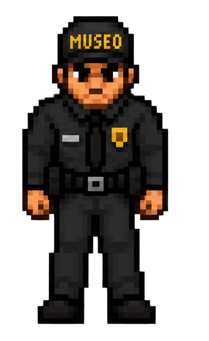
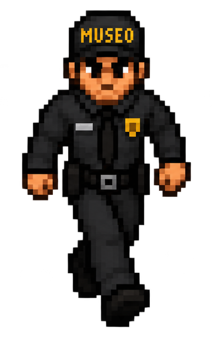
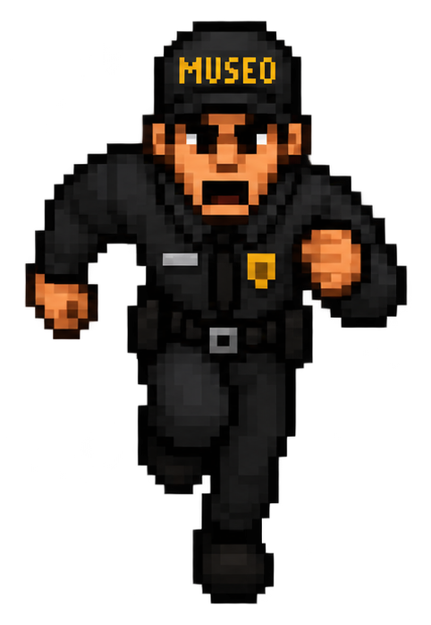
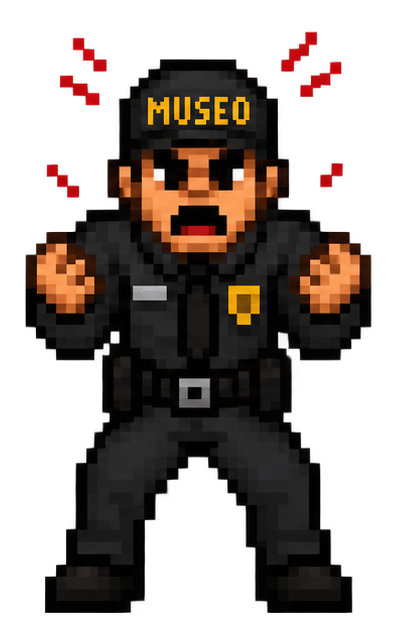
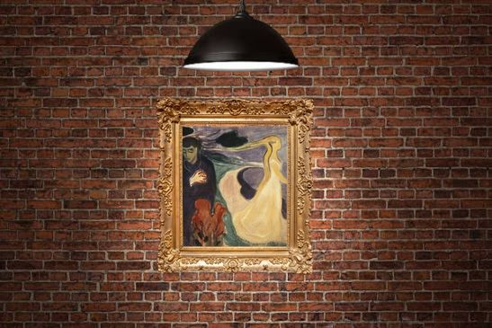
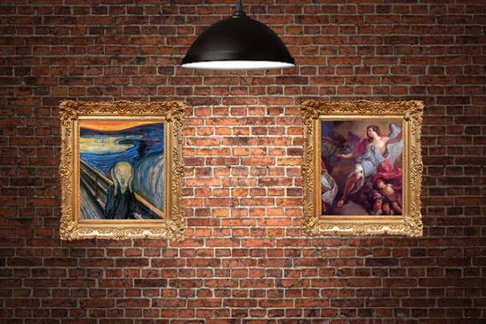
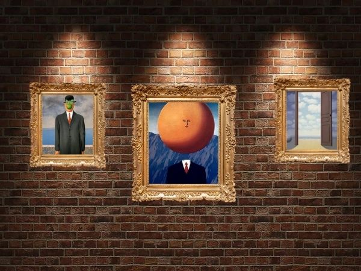
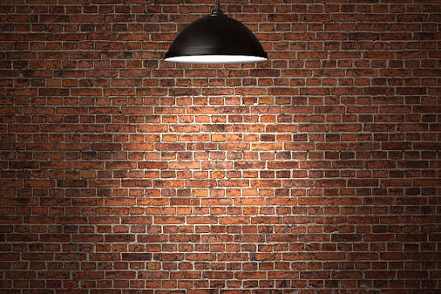
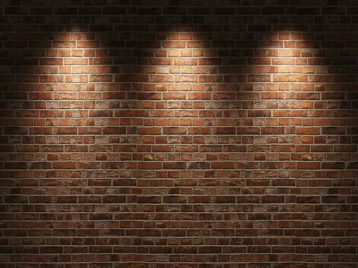

# DOOM Rust - Infiltración en el Museo (Museum Art Heist)

Motor de renderizado 3D estilo Raycasting (Wolfenstein 3D / DOOM clásico) desarrollado en **Rust** con **Raylib** para el curso de **Gráficas por Computadora** en la Universidad del Valle de Guatemala (UVG).

---

## Premisa del Juego

Te has infiltrado como artista callejero en las galerías de un prestigioso museo de arte durante la noche. Tu misión es intervenir las obras maestras clave marcadas como objetivos con disparos de pintura neón fluorescente y escapar por la salida de emergencia antes de que los guardias de seguridad del museo te capturen.

---

## Demostración en Video

[](https://youtu.be/I5DnGbRIplg)

> 📹 **Video completo de gameplay y demostración:** [https://youtu.be/I5DnGbRIplg](https://youtu.be/I5DnGbRIplg)

---

## Galería de Assets

### Guardias de Seguridad (Sprites Billboard)

| Alerta (`guard_idle.png`) | Patrulla (`guard_patrol.png`) | Persecución (`guard_chase.png`) | Ralentizado (`guard_angry.png`) |
| :---: | :---: | :---: | :---: |
|  |  |  |  |

### Muros y Obras de Arte del Museo

| Cuadro Individual (`one/1.jpg`) | Doble Cuadro (`two/3.jpg`) | Tríptico (`three/4.jpg`) |
| :---: | :---: | :---: |
|  |  |  |

| Reflector Individual (`single_spotlight.jpg`) | Reflector Triple (`triple_spotlight.jpg`) |
| :---: | :---: |
|  |  |

---

## Características Principales

- **Renderizado Raycasting 3D con DDA**: Algoritmo Digital Differential Analysis sin artefactos de ojo de pez y con muestreo sub-pixel de texturas.
- **Piso y Techo Temáticos de Museo**:
  - Parquet de madera de roble cálido con vetas sinusoidales, tablas alternadas y juntas oscuras en perspectiva real.
  - Techo arquitectónico con artesonados, vigas estructurales e iluminación ambiental nocturna con niebla de distancia.
- **Renderizado de Sprites Billboard y Z-Buffer**:
  - Guardias de seguridad proyectados en perspectiva con ordenamiento por profundidad e interpolación por columna contra el buffer de profundidad para evitar solapamientos con paredes.
  - Cuatro estados visuales de guardias: Patrulla (`guard_patrol.png`), Alerta (`guard_idle.png`), Persecución (`guard_chase.png`) y Ralentizado (`guard_angry.png`).
  - Overlay reactivo de salpicaduras de pintura fluorescente sobre los guardias impactados.
- **Inteligencia Artificial de Guardias**:
  - Búsqueda de caminos en cuadrícula mediante **BFS (Breadth-First Search)** para sortear muros y esquinas.
  - Detección de proximidad y trazado de línea de visión directa.
  - Alerta global al escuchar disparos en las galerías.
- **Mecánica de Intervención de Arte y Salida**:
  - Obras de arte de museo integradas en los muros de las galerías.
  - Las obras objetivo requieren 3 impactos directos de globos de pintura con salpicaduras en tiempo de ejecución.
  - Salida de emergencia (`Exit`) bloqueada en rojo mientras haya obras pendientes y desbloqueada en verde brillante al completar todos los objetivos.
- **Minimapa Superpuesto en Tiempo Real**:
  - HUD superior derecho con auto-escalado según las dimensiones del nivel.
  - Muestra paredes, jugador con vector angular de visión, guardias en patrulla/persecución, objetivos pendientes/completados y la salida.
- **Sistema de Audio y Música en Streaming**:
  - Reproducción continua en streaming de música ambiental en formato MP3 (*Aphex Twin - Green Calx*).
  - Efectos de sonido integrados y fallback seguro en entornos sin dispositivos de audio.

---

## Controles del Juego

| Acción | Control |
| :--- | :--- |
| **Moverse adelante / atrás** | `W` / `S` o `Flecha Arriba` / `Flecha Abajo` |
| **Desplazamiento lateral (Strafe)** | `A` / `D` o `Flecha Izquierda` / `Flecha Derecha` |
| **Rotación de Cámara (Mouse Look)** | Mover el **Ratón** horizontalmente |
| **Disparar Globo de Pintura** | **Click Izquierdo** del ratón o tecla `Espacio` |
| **Selección de Nivel (Menú)** | Teclas `1`, `2`, `3` o Click en la tarjeta del nivel |
| **Iniciar / Confirmar** | `Enter` o `Espacio` |
| **Pausar / Volver al Selector** | Tecla `Escape` |

---

## Catálogo de Niveles

1. **Nivel 1: Galería de ingreso**
   - **Dimensiones:** $16 \times 12$
   - **Objetivos:** 3 obras de arte
   - **Guardias:** 2 guardias patrullando pasillos principales

2. **Nivel 2: Ala moderna**
   - **Dimensiones:** $24 \times 16$
   - **Objetivos:** 5 obras de arte
   - **Guardias:** 4 guardias con rutas cruzadas

3. **Nivel 3: Archivo nocturno**
   - **Dimensiones:** $32 \times 20$
   - **Objetivos:** 7 obras de arte
   - **Guardias:** 6 guardias vigilando salas y galerías complejas

---

## Formato de Mapas ASCII (`src/assets/maps/`)

Cada archivo de mapa es una cuadrícula de texto plano donde cada carácter define un elemento:

- `1`: Pared de Galería Clásica.
- `2`: Pared Borgoña de Bellas Artes.
- `3`: Pared de Servicio / Mantenimiento.
- `4`: Pared de Acento Moderno.
- `p`: Posición de inicio y spawn del jugador.
- `g`: Salida de emergencia del museo.
- `T`: Obra de arte objetivo (requiere ser intervenida con pintura).
- `d`: Obra de arte decorativa de exposición.
- `e`: Guardia de seguridad.
- ` ` *(Espacio)*: Piso transitable de museo.

---

## Compilación y Ejecución

### Requisitos Previos

- **Rust y Cargo** (edición 2024 o Rust 1.80+): [https://rustup.rs](https://rustup.rs)
- Dependencias de sistema para Raylib en Linux: `libasound2-dev`, `libgl1-mesa-dev`, `libx11-dev`, `libxcursor-dev`, `libxi-dev`, `libxinerama-dev`, `libxrandr-dev`.

### Comandos

```bash
# Compilar y ejecutar en modo optimizado
cargo run --release

# Ejecutar en modo desarrollo
cargo run

# Ejecutar la suite completa de pruebas unitarias
cargo test

# Verificar formato y linting de código
cargo fmt -- --check
cargo clippy --all-targets -- -D warnings
```

---

## Estructura del Código

```text
src/
├── ai.rs           # Navegación BFS, línea de visión, colisiones y persecución de guardias
├── assets.rs       # Carga, caché y decodificación de texturas y sprites de museo
├── audio.rs        # AudioManager, streaming de MP3 y eventos de sonido
├── events.rs       # Control de teclado y rotación de mouse look
├── framebuffer.rs  # Buffer de color 2D, primitivas de dibujo y presentación
├── game.rs         # Bucle principal, HUD, selector de niveles, vidas y Game Over
├── level.rs        # Parser de mapas ASCII, entidades, salpicaduras y objetivos
├── levels.rs       # Catálogo de niveles y asignación de obras de arte
├── main.rs         # Inicialización de ventana y ciclo de vida de la aplicación
├── minimap.rs      # Minimapa superpuesto auto-escalado con iconos de entidades
├── movement.rs     # Física de movimiento y deslizamiento contra muros
├── player.rs       # Estado del jugador (posición, ángulo, radio de colisión)
├── raycasting.rs   # Algoritmo DDA de trazado de rayos y cálculo de intersecciones
└── renderer.rs     # Pipeline 3D, z-buffer, billboards de guardias, piso parquet y techo
```

---

## Créditos y Atribuciones

- **Desarrollo**: Proyecto académico para el curso de Gráficas por Computadora (UVG).
- **Música**: *Aphex Twin - Green Calx* (utilizado para propósitos educativos y demostrativos).
- **Texturas y Arte**: Obras y recursos visuales adaptados de dominio público y colecciones de arte abierto de museos.
